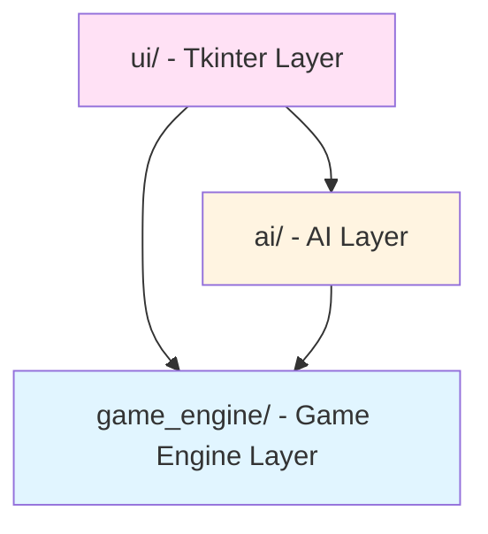
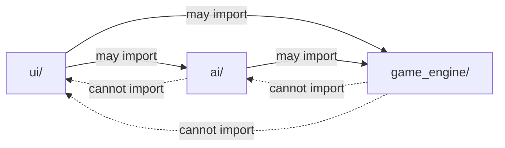

# Architecture Spine — Strategic Reserve

## Design Paradigm

Layered architecture with three distinct layers: Game Engine (core rules and state), AI (move selection), and UI (rendering and input). Game Engine is the foundational layer with no dependencies. AI depends only on Game Engine. UI depends on Game Engine for state and AI for move generation. No circular dependencies allowed.

Layer mapping:
- `game_engine/` — Core game logic, state management, rule enforcement
- `ai/` — Move selection algorithms (rudimentary and advanced)
- `ui/` — Tkinter-based rendering and user input handling



## Invariants & Rules

### AD-1 — State ownership

- **Binds:** FR-5, FR-6, FR-7, FR-8, FR-9, FR-10
- **Prevents:** UI or AI modules directly mutating game state, causing state synchronization issues
- **Rule:** Game Engine owns all game state (board, reserves, current player, winner). UI is stateless and renders current state on demand. AI is stateless and receives state via function parameters, returns move coordinates only. No direct state mutation outside Game Engine.

### AD-2 — Module dependency direction

- **Binds:** all
- **Prevents:** Circular dependencies, tight coupling between layers
- **Rule:** Dependencies flow downward only: UI → AI → Game Engine. Game Engine has no dependencies on AI or UI. AI has no dependency on UI. Import statements must respect this direction.



### AD-3 — Coordinate system abstraction

- **Binds:** FR-2, FR-5
- **Prevents:** Coordinate confusion between player perspectives, hard-to-debug perspective bugs
- **Rule:** Game Engine uses absolute internal coordinates (0-5, 0-5) for all logic. Player perspective mapping (near/far, left/right) is handled only at UI layer. AI receives and returns absolute coordinates. No perspective logic in Game Engine or AI. UI must provide coordinate conversion functions with unit tests verifying correctness for both player perspectives.

### AD-4 — AI interface contract

- **Binds:** FR-11, FR-12
- **Prevents:** AI modules modifying state directly, inconsistent AI implementations
- **Rule:** All AI modules implement `get_move(game_state: GameState, player_color: str) -> tuple[int, int] | None` returning (row, col) or None on error. Game Engine validates move legality before applying. AI cannot call Game Engine mutation methods directly.

### AD-5 — Group detection algorithm

- **Binds:** FR-6, FR-7, FR-8
- **Prevents:** Incorrect group identification, diagonal connections being counted
- **Rule:** Game Engine provides `get_groups(board: list[list], color: str) -> list[list[tuple[int, int]]]` using flood fill algorithm with orthogonal connectivity only (up, down, left, right). Diagonal connections are explicitly excluded. Groups are maximal (no subset of larger connected group).

### AD-6 — Error handling strategy

- **Binds:** all
- **Prevents:** Unhandled exceptions crashing the UI, AI errors propagating to user
- **Rule:** Game Engine raises custom exceptions (`IllegalMoveError`, `InvalidGameStateError`) for rule violations. UI layer catches and displays user-friendly messages. AI layer never raises exceptions — returns None on error and logs internally. No bare `except` clauses.

## Consistency Conventions

| Concern | Convention |
| --- | --- |
| Naming (entities, files, interfaces, events) | Modules and functions: snake_case (game_engine.py, get_legal_moves). Classes: PascalCase (GameState, Board). Constants: UPPER_CASE (BOARD_SIZE=6). |
| Data & formats (ids, dates, error shapes, envelopes) | Board: 6x6 2D list (None for empty, 'RED'/'BLUE' for checkers). Coordinates: (row, col) tuples 0-indexed. Colors: 'RED'/'BLUE' strings. |
| State & cross-cutting (mutation, errors, logging, config) | State mutation only through Game Engine methods. Custom exceptions for domain errors. No global state. Configuration via constants at module level. |

## Stack

| Name | Version |
| --- | --- |
| Python | 3.x |
| Tkinter | Built-in with Python |

## Structural Seed

```text
strategic_reserve/
  game_engine/
    __init__.py
    state.py           # GameState dataclass, Board class
    rules.py           # Dice rolling, hit resolution, win detection
    groups.py          # Group detection (flood fill)
    validation.py      # Move legality checking
  ai/
    __init__.py
    base.py            # Base AI interface
    rudimentary.py     # Random move AI
    advanced.py        # Minimax/stochastic simulation AI
  ui/
    __init__.py
    main.py            # Tkinter main window, game loop
    board_view.py      # Board rendering, dice visualization
    controls.py        # Game controls (new game, quit)
  main.py              # Application entry point
```

## Capability → Architecture Map

| Capability / Area | Lives in | Governed by |
| --- | --- | --- |
| Game Board Visualization | ui/board_view.py | AD-1, AD-3 |
| Game Simulation Engine | game_engine/ | AD-1, AD-5, AD-6 |
| AI Opponents | ai/ | AD-1, AD-4, AD-2 |
| Game Modes | ui/main.py | AD-1, AD-2 |
| Game Controls | ui/controls.py | AD-1, AD-2 |

## Deferred

- **AI search depth configuration** — Hardcoded depth 3-5 for advanced AI acceptable for MVP. Configuration file or runtime parameter deferred to v2.
- **Performance optimization** — No profiling or optimization targets for MVP. Deferred until performance issues observed.
- **Unit testing framework** — No test framework specified in MVP. Deferred to v2 if test coverage needed.
- **Logging infrastructure** — Basic print debugging acceptable for MVP. Structured logging deferred to v2.
- **Save/load functionality** — Not in MVP scope. Architecture for serialization deferred.
